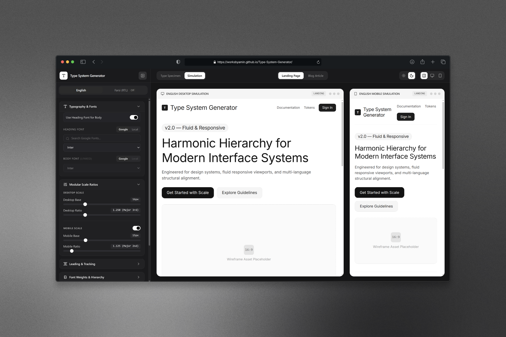
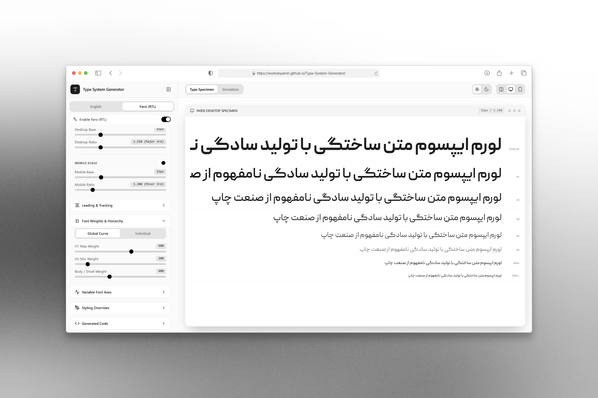

# 📐 Type System Generator ( RTL Support )

  <a href="https://worksbyamin.github.io/Type-System-Generator/">
    
     
    
  </a>

 

  <strong>This app is still in it's early stages and may contain various bugs</strong>

 

  <strong>A powerful, visual web application designed to create, preview, and export comprehensive, fluid typography systems and design tokens.</strong>

  This project was "vibe coded" in a short time because I needed a free, advanced typescale generator with local, variable and rtl font support that simply didn't exist yet!

 

  <strong>Feel free to report bugs or request improvements or features.   This tool will be free and opensource for all of us designers.</strong>

 

  <a href="https://worksbyamin.github.io/Type-System-Generator/"><strong>🚀 View Live Application</strong></a>

 

---

## ✨ Features Breakdown

### 🌐 Bilingual & Synchronized Typographic Scales (LTR & RTL)
- **RTL Support:** Configure English (LTR) and Farsi (RTL) typography and get a combined css or Tailwind(postCss) output. 
- **Synchronized Hierarchy:** Semantic steps (H1-H6, base, small, etc.) dynamically sync across languages to ensure your layout never breaks when switching translations.
- **Language-Specific Overrides:** Maintain unified scaling while tweaking language-specific line heights and letter spacing to match different script metrics.

### 🎛️ Advanced Font Support (Variable & Local)
- **Google Fonts API v2 Integration:** Fully supports variable Google Fonts (like *Inter*, *Roboto Flex*, *DM Sans*). The system intelligently detects and requests specific variable axes (`wght`, `wdth`, `slnt`, `opsz`) and allows you to adjust them via intuitive UI sliders.
- **Local Font Access:** Utilizes the experimental Local Font Access API to load and test fonts installed directly on your machine without needing to upload them.

### 📐 Fluid Modular Scales
- **Mathematical Harmony:** Generate typography scales based on classic modular ratios (Major 3rd, Golden Ratio, Perfect 4th, etc.).
- **Responsive by Default:** Define separate base sizes and ratios for Mobile and Desktop. The exporter automatically calculates and generates modern CSS `clamp()` functions for seamless, fluid scaling across all viewport sizes.

### 👁️ Contextual Real-World Simulations
Don't just look at a list of fonts—stress-test your typography in real-world layouts dynamically.
- **Specimen View:** A traditional, focused view of all semantic steps.
- **Landing Page Simulation:** Previews your typography applied to a high-contrast SaaS marketing layout, complete with hero sections and feature grids.
- **Editorial Blog Simulation:** Previews long-form reading experiences, testing prose line-height, blockquotes, and paragraph rhythms.

### 🎚️ Granular Token Control
- **Leading (Line-Height):** Switch between global baseline multipliers or individual semantic overrides.
- **Tracking (Letter-Spacing):** Fine-tune tracking per heading level for perfect optical alignment.
- **Weight Mapping:** Assign exact numeric weights to individual steps (e.g., 800 for Display, 400 for Base).

### 📦 Production-Ready Code Export
- **Tailwind CSS v4:** Export your system as a fully mapped Tailwind CSS `@theme` and `@utility` block, supporting dynamic RTL switching.
- **Vanilla CSS Variables:** Export a clean set of semantic `--fs-*` variables, line-heights, and tracking tokens ready to drop into any standard web project.

---

## 🛠️ Tech Stack

- **React 18** (Vite)
- **TypeScript**
- **Tailwind CSS v4**
- **Lucide Icons**
